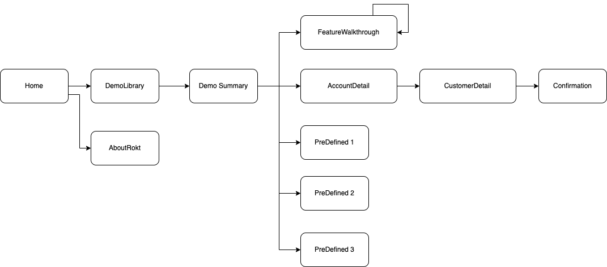

# rokt-demo-ios
Rokt Demo application is a sample app built to showcase Rokt SDK functionality. The purpose of this app is to showcase the functionality that Rokt provides in-app. This is demonstrated with examples of how Rokt’s partners are generating stronger revenue outcomes by providing a more personalized experience for each customer at scale. 

## Resident Experts
- James Newman - <james.newman@rokt.com>
- Thomson Thomas - <thomson.thomas@rokt.com>

## Requirements

XCode 15 and above. Project is configured to run on iOS 13.0 and above.

## Project architecture

This project is implemented based on MVVM pattern with SwiftUI. 

[SwiftUI](https://developer.apple.com/xcode/swiftui/) is a framework made by Apple to build user interfaces across all Apple platforms with the power of Swift. SwiftUI is a user interface toolkit that lets us design apps in a declarative way.
MVVM stands for Model-View-ViewModel, an architecture pattern that is structured to separate program logic and user interface controls. It has Model, View and ViewModel separation. 

This project contains UI, Model, Services, Utils and Resources groups.

UI: View and ViewModels are located in the UI Group.

Services & Model: Services represent the network logics of the application and model represents the data.

Utils: are shared between Groups of the application.

Resources: All the other resources of the application is located in Resources. 

## How to setup the environment?

- open RoktDemo.xcodeproj in Xcode
- click File -> Packages -> Reset Package Caches in Xcode
- click File -> Packages -> Resolve Package Versions in Xcode

## How to run locally?

Open RoktDemo.xcodeproj in Xcode and click Run icon on top left of Xcode.

## How to run tests locally?

Select the RoktDemo scheme and press command + U, or Product -> Test menu on Xcode.
Tests can be found in `RoktDemoTests` and `RoktDemoUIITests`.

## Where are dependencies defined?

[Swift Package Manager](https://www.swift.org/package-manager/) (SPM) is Apple's official dependency manager for Swift projects. SPM integrates directly with Xcode and automatically resolves dependencies, fetches source code, and manages package versions. All dependencies of this project are defined in the Xcode project file and managed through SPM. 

## What are project dependencies
In this application, following dependencies are used: 
-  Rokt-Widget: [Rokt-Widget](https://docs.rokt.com/docs/developers/integration-guides/ios/overview) is Rokt iOS SDK. This app is built to showcase the functionality that this Rokt SDK provides in-app.  
-  Alamofire: [Alamofire](https://github.com/Alamofire/Alamofire) is an HTTP networking library written in Swift. This is used for networking part of the application.
-  SDWebImageSwiftUI: [SDWebImageSwiftUI](https://github.com/SDWebImage/SDWebImageSwiftUI) is a SwiftUI image loading framework. This is used for loading images in SwiftUI.
-  CodeScanner: [CodeScanner](https://github.com/twostraws/CodeScanner) CodeScanner is a SwiftUI framework that makes it easy to scan codes such as QR codes and barcodes.

## How to test point to a version of iOS SDK
To point to a certain version:
- Open RoktDemo.xcodeproj in Xcode
- Select the project in the navigator, then select the RoktDemo target
- Go to the "Package Dependencies" tab
- Find "rokt-sdk-ios" and click the version dropdown
- Select "Up to Next Major Version" and specify the minimum version (e.g., `4.14.1`) or choose a specific version
- Alternatively, you can update the version requirement in the project.pbxproj file by changing the `minimumVersion` value for the Rokt-Widget package reference

## How to release the app
> [!NOTE]
> Testers in `TESTING_GROUPS` repo secret will get the new build.

- Update `Version` and `Build` in RoktDemo target
- Commit & push
- Dispatch the workflow `Distribute to Firebase` from the Actions tab on GitHub

### Automated Release Pipeline
The SDK can be released via the **Mobile Release Pipeline**. Follow the instructions in the Mobile Release Pipeline repo to release. You can still release the app manually by following the steps in the previous section.

### Note

To get Appstoreconnect user access, please ask it from <dj.seo@rokt.com>, <danial.motahari@rokt.com> or <thomson.thomas@rokt.com>

## FAQ

### What are the branches?

The main branches of these repository includes: **main**, **Release-** and **Features branches**

* **main** - Master branch which currently is not used
* **release branches** - Branches with **release-** prefix are considered production branches. After every push to this branch tests are run to ensure no breaking changes are allowed and after approval. Releasing to TestFlight could be enabled after all the tests passes. 
* **feature branches** - All other branches are considered feature branches. After every push to this branch tests are run to ensure no breaking changes are allowed.

### What are the versions?
We are using semantic versioning starting with version 1.0.0. Each new feature requires incrementing minor version and bracking changes require incrementing major version. 
Currently we have following release branches.

* **release-1.x** - The first version of Demo application
* **release-1.1.x** - The PreDefined brand demos added
* **release-1.2.x** - Layouts preview and QR code scan support added

### Something is not working, what do I do?

In case you run into any problems you can try:

* Clean the build folder of the project. Select menu: Product -> Clean Build Folder on Xcode

## License

Copyright 2020 Rokt Pte Ltd

Licensed under the Rokt Software Development Kit (SDK) Terms of Use
Version 2.0 (the "License")

You may not use this file except in compliance with the License.

You may obtain a copy of the License at https://rokt.com/sdk-license-2-0/