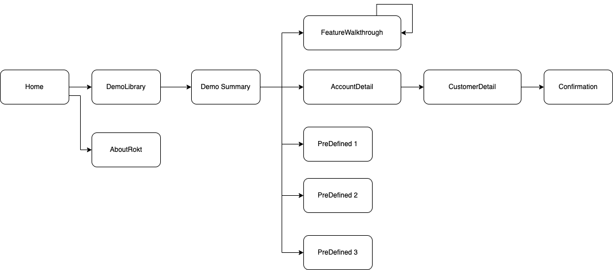

# rokt-demo-ios

Rokt Demo is a sample iOS app built to showcase Rokt SDK functionality. It demonstrates how Rokt's partners generate stronger revenue outcomes by providing personalized experiences for each customer at scale.

## Features

- **In-app Placements** — View examples of embedded and overlay placement experiences with live offers
- **Custom Placement Builder** — Enter your Rokt account details to preview custom placements on a sample confirmation page
- **Pre-defined Demos** — Branded partner confirmation pages (Heated, Stylus Commerce, Waveroom Supply Co)
- **Shoppable Ads** — Test the Shoppable Ads experience with Stripe payment integration, configurable attributes, and SDK event logging

## Requirements

Xcode 15 and above. The project is configured to run on iOS 15.0 and above.

## Project Architecture

This project is implemented using the MVVM pattern with SwiftUI.

[SwiftUI](https://developer.apple.com/xcode/swiftui/) is Apple's declarative UI framework. MVVM (Model-View-ViewModel) separates program logic from user interface controls.

The project is organized into the following groups:

- **UI** — Views and ViewModels
- **Model** — Data models for the placement library and demo items
- **Service** — Network and business logic
- **Utils** — Shared utilities and constants
- **Resources** — App lifecycle, assets, and fonts

## How to Set Up the Environment

1. Open `RoktDemo.xcodeproj` in Xcode
2. Go to File > Packages > Reset Package Caches
3. Go to File > Packages > Resolve Package Versions

## How to Run Locally

Open `RoktDemo.xcodeproj` in Xcode and click the Run button (or press Cmd+R).

## How to Run Tests

Select the `RoktDemo` scheme and press Cmd+U, or go to Product > Test in Xcode.
Tests are located in `RoktDemoTests` and `RoktDemoUITests`.

## Dependencies

All dependencies are managed via [Swift Package Manager](https://www.swift.org/package-manager/) (SPM), which integrates directly with Xcode.

| Dependency | Description |
|------------|-------------|
| [Rokt-Widget](https://docs.rokt.com/developers/integration-guides/ios/overview) | Rokt iOS SDK — the core SDK this app demonstrates |
| [RoktStripePaymentExtension](https://github.com/ROKT/rokt-stripe-payment-extension-ios) | Stripe payment integration for Shoppable Ads |
| [Alamofire](https://github.com/Alamofire/Alamofire) | HTTP networking library |
| [SDWebImageSwiftUI](https://github.com/SDWebImage/SDWebImageSwiftUI) | SwiftUI image loading framework |
| [CodeScanner](https://github.com/twostraws/CodeScanner) | QR code and barcode scanner |

## How to Point to a Specific SDK Version

1. Open `RoktDemo.xcodeproj` in Xcode
2. Select the project in the navigator, then select the RoktDemo target
3. Go to the "Package Dependencies" tab
4. Find "rokt-sdk-ios" and click the version dropdown
5. Select "Up to Next Major Version" and specify the minimum version, or choose a specific version

## How to Release

> [!NOTE]
> Testers in the `TESTING_GROUPS` repo secret will receive the new build.

1. Update `Version` and `Build` in the RoktDemo target
2. Commit and push
3. Dispatch the `Distribute to Firebase` workflow from the Actions tab on GitHub

The app can also be released via the **Mobile Release Pipeline** — follow the instructions in the Mobile Release Pipeline repo.

## Branches

- **main** — Primary branch for development
- **release-\*** — Production release branches
- **feat/\*** — Feature branches

## Troubleshooting

If something is not working, try:

- Clean the build folder: Product > Clean Build Folder in Xcode
- Reset package caches: File > Packages > Reset Package Caches

## License

Copyright 2020 Rokt Pte Ltd

Licensed under the Rokt Software Development Kit (SDK) Terms of Use
Version 2.0 (the "License")

You may not use this file except in compliance with the License.

You may obtain a copy of the License at https://rokt.com/sdk-license-2-0/
